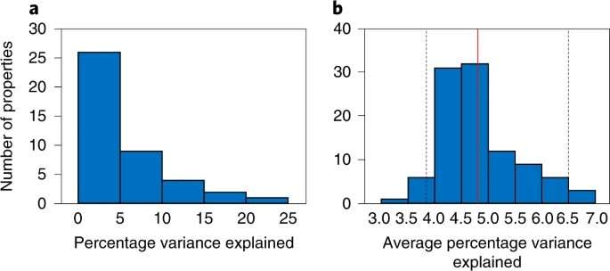

```{r setup, include=FALSE} 
knitr::opts_chunk$set(warning = FALSE, message = FALSE) 
```

```{r}
### The purpose of this paper was to analyze the relationship between plant traits and ecosystem properties to see if plant traits could be used as predictors of ecosystem properties using linear mixed models and calculating marginal r^2 values of those models to investigate the proportion of variance explained by traits. The analysis focused on six plant functional traits as predictors of the ecosystem properties. There were two datasets used, which are saved as p and f in this code. Dataset P contains plot data with variables to be used as the ecosystem properties and dataset f contains the data regarding the plant functional traits for each plot. Dataset "f" contains two separate values for each trait "FD" and "FI", in my analysis I separated the values for each model as using both in each model led to more different results than the authors. 
```


### Load in libraries
```{r}
library(tidyverse)
library(data.table)
library(lme4)
library(MuMIn)
library(MASS)
library(AICcmodavg)
library(broom)
library(stringi)
```

### Load in files
```{r}

### This was one of the included datasets and was used to calculate dataset "f" by the authors. 
f1 <- "https://raw.githubusercontent.com/RyanRay01/data-analysis-replication/main/data/traits.st.csv"
t <- read_csv(f1)

# This is the dataset containing the plot ecosystem functions
f2 <- "https://raw.githubusercontent.com/RyanRay01/data-analysis-replication/main/data/predictors_raw.csv"

p <- read_csv(f2)

head(p)

# This is the dataset containing the plot plant functional trait values.
f3 <- "https://raw.githubusercontent.com/RyanRay01/data-analysis-replication/main/data/functions4.st.csv"

f <- read_csv(f3)

head(f)

```

### Merging of f and p datsets so that there is a single coherent dataset
```{r}
### Give "f" arbitrary "seasons" so it can work with "p"
fe <- f %>% 
      filter(row_number() <= 2000) %>% 
      bind_rows(f)

seasons <- rep(c("spring", "summer"), times = nrow(fe)/2)

fe <- fe %>% mutate(season = c(seasons))

### Create joined dataset "d" by giving rows "plot IDs" and combining them

fe <- fe %>% mutate(Plot_ID = paste(fe$plot,fe$year,fe$season, sep = "_"))
pe <- p %>% mutate(Plot_ID = paste(p$plot,p$year,p$season, sep = "_"))

d <- merge(fe, pe, by = "Plot_ID") %>% subset(select=-c(plot.y,season.y,year.y)) %>%
  setnames( "plot.x", "PlotNum") %>%
  setnames( "year.x", "YearNum") %>%
  mutate(YearNum = as.factor(YearNum))
```

### Create lists of Ecosystem Properties and FI and FD trait names
```{r}
ecoProp <- fe %>%
  subset(select=-c(plot, year, sowndiv, block, season, Plot_ID)) %>%
  colnames()

traitFI <- pe %>% subset(select = c(FI_ra, FI_lbpr,
                  FI_la, FI_sra, FI_srl, FI_RNU, FI_nute, FI_k.rad, 
                  FI_RootingDepth_Target, FI_h1, FI_erect, FI_lar, 
                  FI_fc, FI_sla, FI_lSize, FI_srr, FI_sd, FI_ssd, 
                  FI_leafN, FI_leafC, FI_Nacr, FI_cond, FI_lt, FI_pp, 
                  FI_lsd, FI_ldmc, FI_LCN, FI_rtd, FI_RCN, FI_sdmc, 
                  FI_BM_Target_Inflorescence, 
                  FI_NrInflorescence_Target_Shoot, FI_SeedsProjArea, 
                  FI_SeedsTCW, FI_SeedsWLRatio, FI_NrSeedling_Target, 
                  FI_DurationFlowreing_Target_Phenology, FI_rootCa, 
                  FI_rootK, FI_rootNa, FI_rootP, FI_rootS)) %>% colnames()

traitFD <- pe %>% subset(select = c(FD_ra, FD_lbpr,
                  FD_la, FD_sra, FD_srl, FD_RNU, FD_nute, FD_k.rad, 
                  FD_RootingDepth_Target, FD_h1, FD_erect, FD_lar, 
                  FD_fc, FD_sla, FD_lSize, FD_srr, FD_sd, FD_ssd, 
                  FD_leafN, FD_leafC, FD_Nacr, FD_cond, FD_lt, FD_pp, 
                  FD_lsd, FD_ldmc, FD_LCN, FD_rtd, FD_RCN, FD_sdmc, 
                  FD_BM_Target_Inflorescence, 
                  FD_NrInflorescence_Target_Shoot, FD_SeedsProjArea, 
                  FD_SeedsTCW, FD_SeedsWLRatio, FD_NrSeedling_Target, 
                  FD_DurationFlowreing_Target_Phenology, FD_rootCa, 
                  FD_rootK, FD_rootNa, FD_rootP, FD_rootS)) %>% colnames()

### Six focus traits: SLA, plant height, leaf N concentration, leaf dry matter content, stem tissue density and leaf area

focTraitFI <- c("FI_sla", "FI_h1", "FI_leafN", "FI_ldmc", "FI_ssd", 
                "FI_la")

focTraitFD <- c("FD_sla", "FD_h1", "FD_leafN", "FD_ldmc", "FD_ssd", 
                "FD_la")
```

### Run LMM Model on Ecosystem Properties in "f" using variables in "p" as
### predictors
```{r, results='hide'}
### Create empty list to store models and predictors
lmListFIfull <- list()
lmListFDfull <- list()
predictorsFD <- list()
predictorsFI <- list()
lmMListFIfull <- list()
lmMListFDfull <- list()
lmMListEPnull <- list()

#Create linear models and identify significant predictors
for (i in 1:length(ecoProp)){
  lmListFDfull[[i]] <- lm(paste0(ecoProp[[i]], "~ FD_sla + FD_h1 + FD_leafN + FD_ldmc + FD_ssd + FD_la"), data = d) %>%
    stepAIC(.~., direction = "both") %>%
    tidy() %>%
    tail(-1)
  
  lmListFIfull[[i]] <- lm(paste0(ecoProp[[i]], "~ FI_sla + FI_h1 + FI_leafN + FI_ldmc + FI_ssd + FI_la"), data = d) %>%
    stepAIC(.~., direction = "both") %>%
    tidy() %>%
    tail(-1)
}

# Store predictors in list for use in lmer formula
for (i in 1:length(ecoProp)){
  predictorsFD[[i]] <- lmListFDfull[[i]]$term
  
  predictorsFI[[i]] <- lmListFIfull[[i]]$term
}

# Modify the list for use in lmer() function
for (i in 1:length(ecoProp)){
  predictorsFD[[i]] <- stri_paste(predictorsFD[[i]], collapse = " + ")
  
  predictorsFI[[i]] <- stri_paste(predictorsFI[[i]], collapse = " + ")
}

# Generate models with lmer() for each response variable using the
# associated significant predictors. Plot and Year are random variables
# for creating the models.
for (i in 1:length(ecoProp)){
  
  #Create models for FD values
  lmMListFDfull[[i]] <- lmer(paste0(ecoProp[[i]], " ~ ", predictorsFD[[i]]," + (1 | PlotNum) + (1 | YearNum)"), data = d, na.action = na.omit)
  
  #Create models for FI values
  lmMListFIfull[[i]] <- lmer(paste0(ecoProp[[i]], " ~ ",predictorsFI[[i]]," + (1 | PlotNum) + (1 | YearNum)"), data = d, na.action = na.omit)
  
  #Create null models for use in r.squaredGLMM() 
 lmMListEPnull[[i]] <- lmer(paste0(ecoProp[[i]], "~ (1 | PlotNum) + (1 | YearNum)"), data = d, na.action = na.omit)
  }
```

### Create list of r^2 values using r.squaredGLMM() for each model created
```{r}
rSqrFD <- list()
rSqrFI <- list()

    
for (i in 1:length(ecoProp)){
  
  rSqrFD[[i]] <- r.squaredGLMM(lmMListFDfull[[i]],lmMListEPnull[[i]])
  
  rSqrFI[[i]] <- r.squaredGLMM(lmMListFIfull[[i]],lmMListEPnull[[i]])
}
```
### Take only the marginal r^2 values
```{r}
rSqrFD <- lapply(rSqrFD, "[", , "R2m") 
rSqrFI <- lapply(rSqrFI, "[", , "R2m") 
```

### Put results into a table and calculate mean r^2 values
```{r}
results <- data.frame(EcoProp = character(), R2FI = numeric(), R2FD = numeric(), stringsAsFactors = FALSE)

for (i in 1:length(ecoProp)){
  vec <- c(ecoProp[[i]], rSqrFI[[i]], rSqrFD[[i]])
  results[i, ] <- vec
}

results <- results %>% mutate(R2FI = as.numeric(R2FI), R2FD = as.numeric(R2FD), FIpercentvar = as.numeric(R2FI)*100, FDpercentvar = as.numeric(R2FD)*100)

head(results)

meanFI <- mean(results$R2FI)
meanFI

meanFD <- mean(results$R2FD)
meanFD

### The original paper had a mean r^2 value of 0.078, indicating that a higher amount of variance was explained by their predictors.
```

### Create histograms to recreate Figure 3a.
```{r}
histFI <- ggplot(
                data = results,
                aes(x = FIpercentvar)) +
          geom_histogram(
            breaks = seq(0, 25, 5),
            colour='black') +
          xlab("Percentage variance explained") +
          ylab("Number of properties") +
          xlim(c(0,25)) +
          ylim(c(0,35))

histFI

histFD <- ggplot(data = results, aes(x = FDpercentvar)) +
  geom_histogram(breaks = seq(0, 25, 5)) + xlab("Percentage variance explained") +
  ylab("Number of properties") + xlim(c(0,25)) + ylim(c(0,35))
histFD
```

```{r echo=FALSE, width="###px"}

```

### Discussion
```{r}
# One of the main challenges with replicating this analysis was the author calculated 2 metrics FD and FI for each trait but did not make it clear how these were handled in the creation of the models, or at the very least it was not apparent to me what they did. I was unable to recreate their results by separating the FD and FI values, but even when used both values for creating the models I was unable to achieve the same results. The authors got an average of .078 for their r^2 values, whereas I was only able to get an average of about .2 for both metrics. Despite this, I was able to get a similar right-skewed distribution as the original study. This was to be expected though, since the original authors found that traits were not a good indicator of ecosystem properties. Compared to the original study, I found that over 30 of the 42 ecosystem properties had less than 5% of their variance explained by their predictor variables. Only 4 properties had 5 - 10% of their variance explained using the FD metric, and about 7 using the FI. Using the FI metric I only had one property explained between 10-15% and about three using FD. The original study had about 26 properties from 0 - 5%, nine from 5-10%, four from 10-15%, two from 15-20%, and one from 20-25%. The difference from our results likely stemmed from me not understanding how they handled the FD and FI measurements, as well as some confusion on my part as to how and why they constructed their null model, which led to me using nulls based on each of the ecosystem properties. 
```
